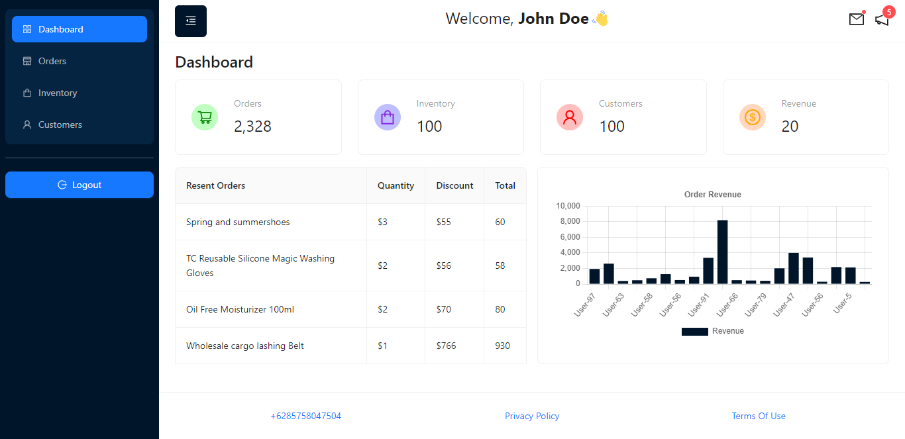

# Dashboard Antd

[](https://dashboard-antd-beta.netlify.app/)

## Developing

Node.js `>= 16.x` setup with [yarn](https://yarnpkg.com/) is recommended.

```bash
# duplicate & fill environment file
cp .env.example

# install dependencies
yarn

# serve with hot reload at localhost:3000
yarn start

# build for production
yarn build
```

## Built with

- Framework - [**ReactJS**](https://reactjs.org/)
- Typechecker - [**Typescript**](https://www.typescriptlang.org/)
- Styling - [**Ant Design**](https://ant.design/)
- Vite - [**Build Tool**](https://vitejs.dev/)
- Icons - [**Ant Design Icons**](https://ant.design/components/icon)
- Data Fetching - [**React Query**](https://tanstack.com/query/latest)
- Cliend Side Routing - [**ReactRouterDOM**](https://reactrouter.com/)
- Package Manager - [**Yarn**](https://yarnpkg.com/)
- Linter - [**Eslint**](https://eslint.org/)
- Deployment - [**Netlify**](https://www.netlify.com/)
- Others
  - Chart - [**Chart.js**](https://www.chartjs.org/)
  - vite-plugin-html - [**lint-staged**](https://www.npmjs.com/package/vite-plugin-html)
